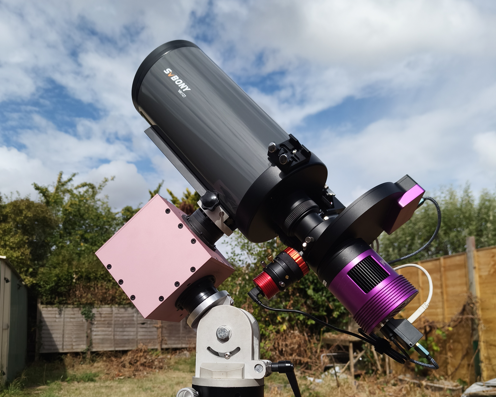

# CubeMate

> **Compact open-source strain-wave drive telescope mount for luggable (portable) astrophotography and visual astronomy**



CubeMate is a compact, open-source telescope mount designed around low-cost strain-wave (harmonic) gearboxes, stepper motors, CNC-machined aluminium parts, and the [OnStepX](https://github.com/hjd1964/OnStepX) control platform.

The project was created because I wanted to build my own mount based around strain-wave gearboxes and evolved into an exploration of how far a practical DIY harmonic-drive mount could be taken using off-the-shelf parts. The result is a vaguely travel-friendly, modular, and compact mount that can be assembled with basic tools. It can operate in either **Equatorial (EQ)** or **Alt-Az** configurations and has been validated with real astrophotography workloads, including guiding at approximately 1 metre focal length while carrying a 6 kg payload.

CubeMate is intended as an **open hardware engineering project**, not a commercial product. It is buildable, modifiable, and intended to be improved by the community.

---

## Project status

CubeMate is currently at a **field-validated prototype / open-hardware release** stage.

The current design has:

- been fully assembled in CNC-machined aluminium;
- been tested in both lightweight and higher-load configurations;
- demonstrated sustained guided astrophotography at approximately 975 mm focal length;
- demonstrated sub-arcsecond guiding for sustained periods;
- successfully produced long guided exposures (10 min) without meaningful exposure-time-dependent star elongation;
- been tested with OnStepX using an ESP32-S3-based controller on a custom PCB;
- been prepared for travel use as a practical hold-luggage astrophotography mount for heavier payloads.

The design is functionally complete, although there are still areas of refinement and experimentation, particularly around firmware behaviour, slew microstepping, mount limits, and future mechanical improvements.

---

## Why CubeMate?

Commercial compact strain-wave drive mounts are excellent, but they were also extremely expensive when this project started. In recent years cheaper options using a similar mechanical principle to CubeMate have appeared, but the major commercial brands still typically cost several times the parts cost of assembling CubeMate.

CubeMate was designed around my personal priorities:

- **open mechanical and electronic design;**
- **commodity strain-wave drives and motors;**
- **repairability and replaceable controller hardware;**
- **luggable form factor;**
- **real astrophotography performance rather than theoretical payload claims;**
- **modularity and scope for future upgrades.**

The aim is not to claim that CubeMate is a drop-in replacement for every commercial strain-wave mount. Commercial products offer advantages such as factory QA, tested periodic-error characteristics, support, warranties, and polished integration.  Some manufacturers, such as MLAstro, offer similar repairability along with all the other commercial benefits of precision and support.

CubeMate instead demonstrates what can be achieved with open hardware, relatively inexpensive components, careful mechanical design, and community software. It is not unique in this, but the design is highly modular and can be extended around the same basic form factor and principle.

---

## Why 'Luggable' and not 'Portable'

CubeMate is notionally portable, and my wife and I certainly will be travelling with it, but it is not something you can simply throw into your hand luggage. It's the same size and weight of many commercial strain-wave mounts and it bothers me that they refer to them as portable!  The term is a deliberate nod to the old Compaq "luggables": portable PCs, certainly, but a long way from what laptops would eventually become.

---

## Why the name CubeMate?

During development I used AI extensively to check calculations, analyse guiding logs, and accelerate a variety of supporting tasks so that I could spend more time on the engineering decisions themselves. At one point, somewhat randomly, the AI referred to the project as "CubeMate". I liked the name enough that it stuck.

---

## Key features

- Compact CNC-machined aluminium construction
- Strain-wave drive RA and DEC axes
- Belt reduction between stepper motor and strain-wave gearbox
- Equatorial and Alt-Az operation
- Inexpensive ESP32-S3 controller
- OnStepX-compatible control electronics
- Open mechanical design
- Open PCB and wiring documentation
- Modular axis and mounting interfaces
- Designed for luggable astrophotography
- Proven with guided imaging at approximately 975 mm focal length
- Designed to be serviceable and reproducible using readily obtainable parts

---

## Mechanical architecture

The current CubeMate prototype uses:

- **Type 14 cup-style strain-wave drives**
- **100:1 primary reduction**
- **NEMA 17 stepper motors**
- **GT2 belt reduction**
- **16-tooth motor pulley**
- **80-tooth driven pulley**
- **5:1 belt reduction**
- **500:1 total reduction**

The structure is CNC-machined aluminium and is designed around a compact cube-like form factor using a fully enclosed torsion-box structure for stiffness.

The current luggable configuration is intended for imaging payloads in the approximate **5–10 kg class**, with higher loads possible depending on balance, counterweight use, strain-wave drive selection, tripod/pier stiffness, and imaging requirements.

Larger strain-wave drives and stronger motors remain possible future development paths.

---

## Electronics and control

CubeMate uses a custom controller PCB designed around a **Waveshare ESP32-S3 Zero** and TMC2209 stepper drivers.

The mount runs **OnStepX**, which provides:

- telescope mount control;
- sidereal tracking;
- GOTO operation;
- guiding support;
- EQ and Alt-Az mount modes;
- meridian and limit handling;
- INDI / application integration.

OnStepX needs to be downloaded separately and compiled with the supplied pinmap and configuration files along with any other desired software changes.

The repository includes CubeMate-specific configuration material and the custom ESP32-S3 pin map required for the controller PCB.

> **Important:** always verify the supplied pin map against the PCB revision being built. Step/direction assignments and TMC UART addressing must agree with the physical board.

---

## Proven astrophotography performance

CubeMate has been tested using several imaging configurations.  These were all performed in suburban Bristol and not under pristine dark skies.

### ~180 mm imaging

With a lightweight imaging payload consisting of a ZWO ASI585MC Air and a Nikon 180 mm prime lens, using the custom wedge and an EQ5 tripod, CubeMate has demonstrated sustained sub-arcsecond guiding.

### ~975 mm imaging

The mount was also tested with a substantially more demanding imaging train consisting of an SVBONY MK127 using its supplied focal reducer giving approximately **975 mm focal length** paired with an Altair filter wheel, an Altair 585MM camera, and a ZWO off-axis guider with a QHY5L-II-M guide camera, along with a stepper motor, bracket, and a DIY Moonlite compatible focuser, in conjunction with the custom wedge and an EQ5 tripod.  This payload is approximately 6 kg in total - a 1.9 kg counterweight was used.

Representative results with this payload included:

- mature guiding around **1.2–1.4 arcsec RMS** near the celestial equator;
  - approximately **0.88 arcsec RMS** during a 240-second exposure;
  - approximately **1.15 arcsec RMS** during a 300-second exposure;

- sustained sub-arcsecond intervals imaging a more favourable high declination target (C4);
  - approximately **0.59 arcsec RMS** during a 300-second exposure;
  - approximately **0.85 arcsec RMS** during a 600-second exposure.

Matched-star analysis showed no meaningful increase, or variation, in star elongation across exposure durations from 1 to 10 minutes.

These results are included as engineering validation rather than guaranteed performance. Guiding performance depends heavily on seeing, payload, balance, polar alignment, guiding configuration, optical geometry, tripod stiffness, wind, and individual strain-wave drive characteristics.

---

## Periodic error and guiding

As expected for an inexpensive commodity strain-wave gearbox, the RA axis exhibits periodic error.

Testing has shown a strong repeatable periodic component of approximately **428–431 seconds** in the Type 14 gearbox currently installed on the RA axis.

PHD2 Predictive PEC (PPEC) materially improves RA guiding once the period is learned.

Different gearboxes will almost certainly exhibit different periodic error. Because CubeMate is designed around off-the-shelf components this variability is treated as something to accommodate through guiding rather than eliminate through individual selection of expensive high-precision components.

---

## Payload

CubeMate does not use a single absolute payload rating because useful payload depends on the application, counterweights, distance of the payload from the centre of rotation, and many other factors.

As a practical guide:

- **5–6 kg without counterweight** is a realistic upper limit for luggable-use;
- around **10 kg** is a sensible design target for the current luggable configuration with appropriate counterweights;
- larger loads may be possible with a combination of counterweighting and careful setup;
- future Type 17 or larger strain-wave-drive variants could increase the available torque substantially.

For astrophotography, guiding performance is a more useful measure than whether the mount can simply carry a given mass.

---

## Counterweights

Like many strain-wave-drive mounts, CubeMate can be used without a counterweight for lighter payloads.

Counterweights can still be useful because they:

- reduce static loading on the RA strain-wave drive;
- reduce tripod overturning moment;
- improve stability with longer or heavier optical systems;
- increase the usable payload range.

The current design supports counterweight use where required using a counterweight shaft with a 12 mm thread. This allows several different off-the-shelf counterweight systems to be used.  The reference model uses a ZWO counterweight shaft with a 12 mm thread and a 20 mm diameter and SkyWatcher EQ5 weights.

---

## Equatorial mounting

CubeMate can be configured for equatorial use.

The current prototype uses a **custom EQ wedge**. That wedge is not included in the initial open release because the present design is functional but not sufficiently user-friendly to be recommended as a general solution.

Instead, the repository includes interface parts that allow CubeMate to be attached to other EQ wedge solutions, including:

- **Vixen-style dovetail interface**

A more refined open EQ wedge is planned for the future.

---

## Alt-Az operation

CubeMate can also be operated as an Alt-Az mount through OnStepX.

This makes it suitable for:

- visual astronomy;
- planetary imaging;
- solar and lunar work;
- short-exposure imaging;
- applications where field rotation is acceptable or compensated elsewhere.

---

## Build cost

The current prototype was built for approximately **US$400–500 in parts**. I believe that offers very strong value when measured against its performance.

This figure is indicative only and excludes:

- tools;
- development costs;
- optional accessories;
- tripod / pier / wedge;
- imaging equipment;
- shipping variation;
- import taxes;
- local CNC pricing.

The CNC aluminium parts for the prototype cost approximately **US$250 delivered** in the UK, including shipping and tax. The Type 14 strain-wave gearboxes can be sourced for as little as approximately **US$100 each**, including shipping and tax. These two expenditures account for the bulk of the build cost.

Repeat builds may vary significantly depending on supplier and location. Supply chain status and availability of materials will also impact spot pricing.

---

## Repository contents

The repository is divided into the following functional directories:

```text
/
├── README.md
├── LICENSES.md
├── hardware/
│ ├── Mechanical/
│ └── PCB/
├── firmware/
│ ├── Config.h
│ ├── Extended.config.h
│ └── Pins.MaxESP4.h
└── Documentation/
```

The repository includes:

- mechanical STEP files;
- manufacturing drawings;
- PCB design files;
- controller pin mapping;
- CubeMate-specific OnStepX configuration;
- Bill of Materials;
- assembly documentation.

---

## Assembly

Detailed assembly instructions are provided separately in the documentation.

The high-level build sequence is:

1. Assemble the strain-wave-drive axis structures.
2. Fit shafts, bearings, pulleys, and belts.
3. Install the stepper motors.
4. Assemble the RA and DEC structures.
5. Install the controller electronics.
6. Connect the stepper drivers and motors.
7. Attach the payload mounting interface.
8. Install the mount onto the chosen EQ wedge, pier, tripod, or Alt-Az base.
9. Flash and configure OnStepX.
10. Verify axis direction, travel limits, current settings, and motor mapping before mounting valuable equipment.

---

## Firmware

CubeMate uses [OnStepX](https://github.com/hjd1964/OnStepX).

OnStepX is a separate project and remains subject to its own licence.

CubeMate-specific configuration files are supplied only to make it easier to reproduce the tested hardware configuration.

Builders should retain a known-good firmware image before experimenting with settings such as:

- tracking microsteps;
- slew microsteps;
- motor current;
- Axis-1 limits;
- meridian behaviour;
- limit recovery;
- guide rate;
- mount startup behaviour.

---

## Safety

CubeMate is an experimental open-hardware telescope mount.

A telescope mount is capable of producing substantial torque and can damage equipment, trap fingers, wrap cables, or drive an optical system into a tripod or pier if incorrectly configured.

Builders are responsible for validating:

- axis directions;
- software limits;
- physical clearances;
- cable routing;
- current limits;
- power supply;
- motor temperature;
- balance;
- mount stability.

Always test motion without valuable optics attached when commissioning a new build or firmware configuration.

---

## Licensing

CubeMate uses separate licences for hardware and documentation.

### Hardware

Unless otherwise stated, CubeMate hardware design files are licensed under:

**CERN Open Hardware Licence Version 2 — Strongly Reciprocal (CERN-OHL-S-2.0)**

This includes relevant:

- PCB design files;
- schematics;
- mechanical CAD;
- STEP files;
- manufacturing drawings;
- hardware assemblies.

### Documentation

Documentation is licensed under:

**Creative Commons Attribution-ShareAlike 4.0 International (CC BY-SA 4.0)**

### Software

CubeMate does not redistribute OnStepX.

OnStepX and other third-party software remain under their respective licences.

### Name and branding

The **CubeMate** name, logo, and project branding are not licensed under CERN-OHL-S-2.0 or CC BY-SA 4.0.

Use of the open hardware does not imply that a derived product is manufactured, certified, endorsed, or supported by the CubeMate project.

See `LICENSES.md` for full details and the individual `LICENSE` file in each directory for the full text of the applicable licence.

---

## Contributing

Contributions, testing results, documentation improvements, and hardware refinements are welcome.

Particularly useful contributions include:

- build reports;
- alternative CNC / manufacturing approaches;
- verified component substitutions;
- guiding performance data;
- alternative EQ wedge designs;
- controller improvements;
- mechanical tolerance feedback;
- firmware configuration findings.

When submitting performance results, please include enough information to make the data useful, such as focal length, payload, guide configuration, exposure duration, seeing conditions where known, and firmware/configuration details.

---

## Project philosophy

CubeMate exists because a telescope mount does not have to be a sealed proprietary appliance.

The project is intended to remain:

- understandable;
- repairable;
- reproducible;
- modifiable;
- experimentally useful.

Commercial manufacture, group buys, assembled boards, and paid build services are compatible with the project licence, provided the obligations of the CERN-OHL-S-2.0 licence are respected for covered hardware derivatives.

---

## Acknowledgements

CubeMate would not exist without the work of the OnStep / OnStepX community and the wider open-source astronomy ecosystem.

Particular thanks go to the developers and contributors behind:

- [OnStepX](https://github.com/hjd1964/OnStepX)
- PHD2
- INDI
- KStars / EKOS

and to everyone who has documented, tested, and shared practical experience with DIY telescope mounts and harmonic-drive systems.

---

## Disclaimer

CubeMate is provided as open hardware without warranty.

Build and use it at your own risk.

Astronomy equipment can be expensive. Verify every axis, limit, connector, voltage, current setting, and firmware configuration before connecting valuable equipment.

---

**CubeMate — compact, open, repairable, and extendable hardware for astronomy.**
